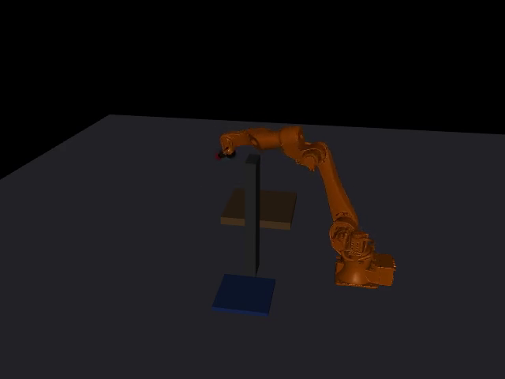

# Pick-and-Place Scenario Runner (KUKA KR35 R1840-3 + suction)

A local scenario schema + MuJoCo runner for scripted pick-and-place
episodes, built around a KUKA KR CYBERTECH (KR35 R1840-3) arm with a
suction end effector, using KUKA's real published meshes for both
rendering and collision.

## Layout

```
robot/
  build_kr35_mjcf.py    generates the robot MJCF from real KUKA joint/mesh/inertial data
  kr35_r1840_3_hw.xml   generated output (run build_kr35_mjcf.py to refresh)
  tune_gains.py         empirical actuator-gain settle test (see "Design overview" below)
  meshes/kr35/          real KUKA visual + collision meshes (see ATTRIBUTION.md)
schema/
  scenario.schema.json  JSON Schema for scenario YAML files
  examples/
    basic_pick_place.yaml
    obstacle_pick_place.yaml   same task, with a wall between pick and place
runner/
  geometry.py           quaternion/pose helpers
  scene_builder.py      scenario YAML -> compiled MuJoCo model (mujoco.MjSpec)
  ik.py                 damped-least-squares IK w/ random-restart fallback
  planner.py            joint-space RRT-Connect w/ real collision checking (transit leg only)
  trajectory.py         waypoint state machine, suction engage/release, success eval
  runner.py             CLI: validate, run, batch, optional MP4 video
```

## Prerequisites

```
pip install mujoco scipy imageio[ffmpeg] 
```

## Running it

```
cd runner
python3 runner.py ../schema/examples/basic_pick_place.yaml
python3 runner.py ../schema/examples/basic_pick_place.yaml --trials 30 --seed-from 0
python3 runner.py ../schema/examples/basic_pick_place.yaml --video out.mp4
python3 runner.py ../schema/examples/obstacle_pick_place.yaml --video out_obstacle.mp4
```

Exit code is 0 on success (or all trials succeeding in batch mode), 1 otherwise.
A batch run prints a summary with `success_rate` and a `failure_reasons` histogram.

## Demo

`obstacle_pick_place.yaml`: the transit-leg RRT-Connect planner routing the
arm sideways around a wall standing between the table and the tray, while
holding the picked cube.

<video src="renders/kr35_obstacle_demo.mp4" controls width="480">
  Your viewer can't play inline video -- see <code>renders/kr35_obstacle_demo.mp4</code> directly.
</video>



## Design overview

- **Robot**: KUKA KR35 R1840-3 (CyberTech family, 35kg payload class),
  modeled from KUKA's real published xacro/mesh data
  (`kroshu/kuka_robot_descriptions`, Apache-2.0) -- real joint kinematics,
  per-link mass/inertia, and real visual + collision meshes, not
  approximated primitives. See `robot/build_kr35_mjcf.py` and
  `robot/meshes/kr35/ATTRIBUTION.md`.
- **Suction**: MuJoCo has no vacuum physics, so grasping is a
  contact-triggered `weld` equality constraint -- engages on contact,
  releases on command. See `trajectory.py` around `suction_engaged` /
  `suction_released`.
- **Schema scope**: one YAML file = one full runnable episode (scene +
  robot config + task + success criteria), not just a bare goal spec. See
  `schema/scenario.schema.json`.
- **Motion**: scripted, not a learned/pluggable policy -- IK per waypoint,
  driven via smoothstep joint-space interpolation timed from the KR35's
  real per-joint velocity limits.
- **Transit planning**: the pick_lift -> place_hover crossing goes through
  a real joint-space RRT-Connect planner (`runner/planner.py`) with genuine
  MuJoCo collision checking, rather than a hand-picked "fly higher"
  waypoint -- see `schema/examples/obstacle_pick_place.yaml` and the demo
  above.
