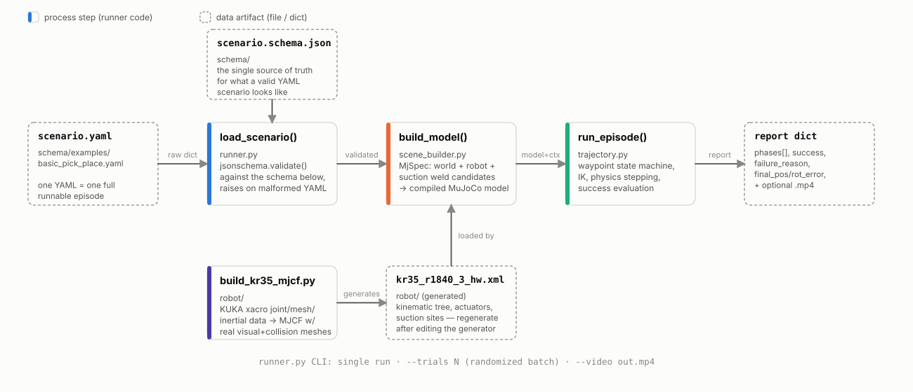
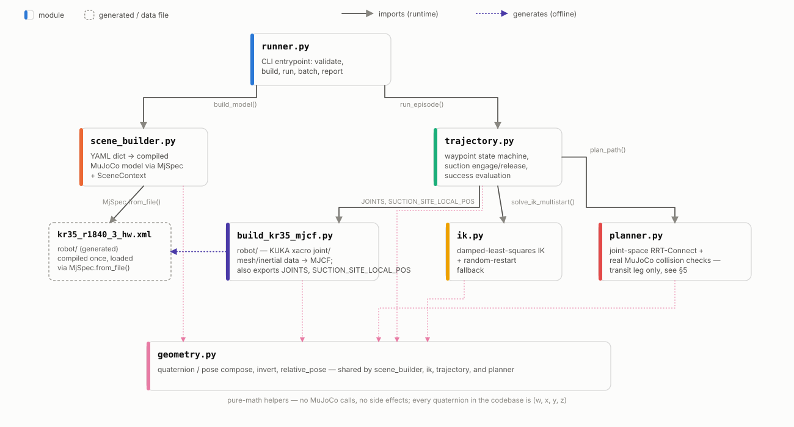
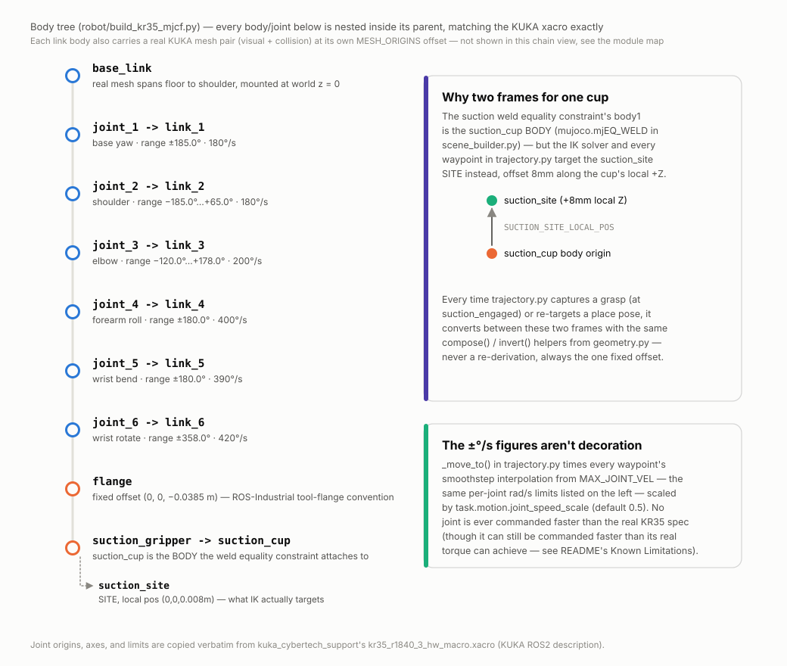
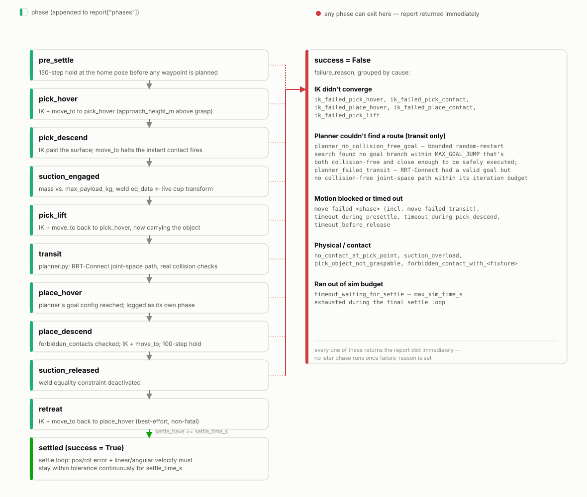

# Pick-and-Place Scenario Runner — Architecture & Functional Design

This document describes how `pick_place_sim` is put together: the execution
pipeline, the module boundaries, the robot model, and the scripted-motion
state machine that actually performs a pick-and-place episode. It's a
companion to the repo's `README.md` (which focuses on how to run things and
what's out of scope for a first pass) — this doc focuses on *why the code is
shaped the way it is*.

At a glance: a scenario is a single YAML file describing a robot, a scene,
and a task. The runner validates it, compiles it into a MuJoCo physics
model, scripts a KUKA KR35 R1840-3 arm through a pick-and-place waypoint
sequence — numerical inverse kinematics for each waypoint, plus a real
joint-space motion planner (RRT-Connect, with genuine collision checking)
for the one leg where routing around something actually matters — and
reports whether the object ended up where it was supposed to.

## 1. End-to-end pipeline

`runner.py` is the only entry point a user touches. `load_scenario()` reads
a YAML file and validates it against `schema/scenario.schema.json` with
`jsonschema` before anything else happens — a malformed scenario fails fast
with a schema error rather than surfacing as a confusing `KeyError` three
layers into scene construction. The validated dict is then handed to
`scene_builder.build_model()`, which returns a compiled `mujoco.MjModel` /
`mujoco.MjData` pair plus a `SceneContext` — a small dataclass carrying the
name/id bookkeeping (object body names, fixture top-surface poses, joint
names, the RNG used for randomization) that the trajectory planner needs but
that doesn't belong in the compiled model itself.

`trajectory.run_episode()` then drives the actual episode: it plans and
executes the scripted waypoint sequence, steps physics, and returns a report
dict (`phases` executed, `success`, `failure_reason`, final position/
orientation error). `runner.py` either prints that dict directly (single
run) or runs it `--trials N` times with an incrementing seed and aggregates
a `success_rate` and a `failure_reasons` histogram — the batch mode is what
the README's per-scenario success-rate figures (100% for
`basic_pick_place.yaml`, ~73% for the deliberately harder
`obstacle_pick_place.yaml`, see §5 and §6) come from. `--video` additionally
attaches a MuJoCo offscreen renderer via an `on_frame` callback threaded
through `run_episode()`, so recording adds no branching to the episode logic
itself.

The robot side of this pipeline has an offline half that's easy to miss:
`robot/build_kr35_mjcf.py` is not run by the pipeline above at all. It's a
standalone generator that turns KUKA's published joint/mesh/inertial data
into the static `robot/kr35_r1840_3_hw.xml` MJCF file, which
`scene_builder.py` then loads like any other asset. Editing the generator
requires re-running it manually (`python3 build_kr35_mjcf.py`) before the
change shows up in a scenario — there's no build step wired into
`runner.py` that does this automatically, which is a deliberate simplicity
trade-off for a single-robot project. A second, also-offline script,
`robot/tune_gains.py`, holds a handful of representative poses under
gravity and reports residual settle error; it's how the actuator gains
discussed in §5 were chosen, and like the MJCF generator it's meant to be
re-run by hand after a change, not wired into the runner.

## 2. Module map

Seven Python files do all the work, and the dependency graph is
intentionally shallow — nothing here is more than two import-hops from
`runner.py`:

- **`runner.py`** is pure orchestration: argument parsing, schema
  validation, and the single-run/batch/video branching described above. It
  has no simulation logic of its own.
- **`scene_builder.py`** turns a validated scenario dict into a compiled
  model. It's the only module that constructs MuJoCo geometry — ground
  plane, fixtures, randomized objects, and the robot itself — and it's
  described in more detail in §4.
- **`trajectory.py`** is the largest module and owns the actual episode: the
  waypoint state machine, the contact-triggered suction weld, and success
  evaluation. It's described in §5.
- **`ik.py`** is a standalone numerical IK solver — damped least squares
  with a random-restart fallback — with no knowledge of scenarios, phases,
  or suction. It solves one thing: "what joint angles put this site at this
  pose," given a model and a warm-start guess.
- **`planner.py`** is a standalone joint-space RRT-Connect motion planner
  with real MuJoCo collision checking, used by `trajectory.py` for exactly
  one leg of the episode (transit — see §5). Like `ik.py`, it has no
  knowledge of scenarios or phases; it solves "find a collision-free
  joint-space path from A to B," given a model, a start/goal configuration,
  and (optionally) a rigidly-held object to account for. It runs all
  collision checks on its own scratch `MjData`, never the live simulation
  state passed in from `trajectory.py`.
- **`build_kr35_mjcf.py`** is both a script (generates the robot MJCF, see
  §1) and, unusually, a runtime import: `trajectory.py` imports its `JOINTS`
  list and `SUCTION_SITE_LOCAL_POS` constant directly, rather than
  re-deriving the KR35's real per-joint velocity/effort limits or the
  suction site's local offset from the compiled model. This keeps those
  numbers defined exactly once.
- **`geometry.py`** is pure quaternion/pose math — `compose`, `invert`,
  `relative_pose`, `quat_from_z_align`, and friends — with no MuJoCo calls
  and no side effects. It's imported by all four of `scene_builder.py`,
  `ik.py`, `trajectory.py`, and `planner.py` (which uses `compose()` to
  predict the held object's pose at each candidate configuration — see §5),
  which is why it sits at the bottom of the graph: every pose computation in
  the codebase, from randomizing an object's yaw to converting between the
  suction cup's body frame and its site frame, funnels through these same
  few functions. One convention
  worth internalizing before reading any of the other modules: **every
  quaternion in this codebase is `(w, x, y, z)`**, matching MuJoCo's own
  convention rather than scipy's default `(x, y, z, w)` — `geometry.py`'s
  helpers do that reordering at the boundary so nothing downstream has to
  think about it.

## 3. The robot model

This project originally modeled a smaller KR16 R2010-2 with capsule/sphere
primitives standing in for missing real meshes (see git history and
`claude/kr16_visual_fidelity_notes.md` in the project docs for that era's
design). It was replaced entirely with a KUKA KR35 R1840-3 (CyberTech
family, 35kg payload class) once KUKA's real mesh and inertial data for
that model became available from `kroshu/kuka_robot_descriptions`
(Apache-2.0). `build_kr35_mjcf.py` now generates a MuJoCo body tree where
essentially everything is copied verbatim from KUKA's own ROS2 xacro
(`kuka_cybertech_support`'s `kr35_r1840_3_hw_macro.xacro`) rather than
estimated: joint positions, axes, rotations, angle limits, and velocity
limits as before, but now also each link's real mass, center of mass, and
diagonal inertia tensor (`LINK_INERTIALS`), and — the actual scope of this
migration — each link's real visual and collision geometry.

The upstream visual meshes ship as `.dae` (Collada); MuJoCo's native mesh
loader only reads STL/OBJ/MSH, so each one is converted to `.stl` with
`trimesh` at build time (the converted files are checked into
`robot/meshes/kr35/visual/`, not regenerated at runtime). The conversion
preserves geometry exactly but not per-submesh materials, so every link is
painted a single uniform KUKA-orange in the MJCF — the same simplification
the old capsule model already made, just on real geometry instead of
primitives now. Collision meshes are KUKA's originals, copied byte-for-byte
into `robot/meshes/kr35/collision/`; MuJoCo convex-hulls each one
automatically at compile time, which is a meaningful accuracy upgrade over
the old capsule approximation even though it's still one convex hull per
link rather than a concave decomposition. Each link body's two mesh geoms
(visual, `contype`/`conaffinity` 0 so they never participate in physics;
collision, the one that actually collides) are placed at that link's own
`MESH_ORIGINS` offset — copied verbatim from the xacro's per-link
`<visual>/<collision><origin>` — not at the body origin, since KUKA's mesh
authoring places each link's geometry with its own local pos/rpy rather
than assuming it's pre-centered. `robot/meshes/kr35/ATTRIBUTION.md`
documents the source, license, and conversion caveats in full.

Getting that mesh placement right surfaced a bug that had been silently
wrong since the original KR16 build: `rpy_to_quat_wxyz()` converts URDF's
fixed-axis (extrinsic) X-Y-Z `rpy` into a MuJoCo quaternion via scipy's
`Rotation.from_euler`, and scipy's axis-letter casing means the opposite of
what it looks like at a glance — lowercase (`'xyz'`) is extrinsic, uppercase
(`'XYZ'`) is intrinsic. The KR16 build used uppercase, which happened to be
harmless there because every `rpy` value in that xacro was single-axis
(where intrinsic and extrinsic rotations are identical), so the bug never
had a chance to manifest. KR35's real `MESH_ORIGINS` data is genuinely
multi-axis for several links, and the bug showed up immediately and
unambiguously on the first render: link meshes rendered as disconnected,
scattered pieces instead of an assembled arm. Fixed by switching to
lowercase; verified numerically against the explicit
`R = Rz(yaw) @ Ry(pitch) @ Rx(roll)` matrix product, not just by eyeballing
the corrected render.

Unlike KR16 (whose base had no available mesh and needed an invented
`BASE_PEDESTAL_HEIGHT` capsule stand-in to lift the whole arm off the
floor), KR35's real `base_link` mesh already spans from floor level to the
shoulder on its own, so the robot mounts directly at the world origin with
no invented offset — one less made-up number in the model. Swapping in a
different KUKA model later would touch `JOINTS`, `LINK_INERTIALS`, and
`MESH_ORIGINS` together (they all come from the same source xacro), plus
the mesh files themselves; the kinematic-tree construction logic in
`build_mjcf()` itself doesn't need to change.

The one frame relationship worth understanding before touching
`trajectory.py` is the split between the suction cup's **body** and its
**site**, shown in the diagram's right-hand panel. The suction weld
equality constraint (§5) attaches to the `suction_cup` *body*, because
MuJoCo equality constraints are defined between bodies. But the IK solver
and every waypoint target the `suction_site` *site* instead, offset 8mm
along the cup's local +Z — sites are MuJoCo's mechanism for a named
reference frame that isn't a full body, which is what you want for "the
point IK should drive to a target pose." `trajectory.py` converts between
the two with `geometry.py`'s `compose()`/`invert()` every time it needs to
move between "the transform the physics engine tracks" and "the transform
the planner targets," using the fixed local offset `SUCTION_SITE_LOCAL_POS`
imported from the generator — never a re-derivation.

## 4. Scenario schema and scene assembly

A scenario YAML is validated against `schema/scenario.schema.json`, which
is intentionally strict (`additionalProperties: false` throughout) so that
a typo'd field fails validation instead of being silently ignored. The
top-level shape is `robot` + `scene` + `task` + `success_criteria`: the
robot's base pose, home joint angles, and suction parameters; the scene's
static `fixtures` (tables, trays — box or cylinder only, never randomized)
and dynamic `objects` (box/cylinder/sphere, each optionally with a
`randomize` block for uniform position/yaw sampling seeded from the
scenario's top-level `seed`); the task's `pick` (which object, optional
explicit grasp point, approach axis) and `place` (an explicit pose, or "on
top of this fixture"); and the `success_criteria` that `trajectory.py`'s
final settle loop checks against.

`scene_builder.build_model()` assembles three things at the `mujoco.MjSpec`
level — MuJoCo's pre-compile scene-graph API — before compiling once:

1. A **world spec**: ground plane, then a body per fixture and a
   free-jointed body per object, with randomization resolved (sampled from
   the scenario's seeded RNG) before the body is even added to the spec.
2. The **robot spec**, loaded whole from `robot/kr35_r1840_3_hw.xml` and
   attached at a frame placed at `scenario.robot.base_pose`.
   `MjSpec.attach()` prefixes every attached body, joint, actuator, and
   site with `robot_` — which is why `trajectory.py` and `ik.py` refer to
   `robot_joint_1`, `robot_suction_site`, and so on rather than the bare
   names defined in the generator.
3. One **inactive weld equality constraint per graspable object** — see §5
   for why these start deactivated and get their `relpose` rewritten at
   runtime rather than being fully specified up front.

Only after all three are assembled does `world.compile()` run, producing
one `MjModel`. Object poses and the robot's home joint configuration are
then written into `MjData.qpos` — deliberately *after* compilation, because
free-joint `qpos` is what actually drives simulation state; setting it on
the spec's nominal pose alone wouldn't stick.

## 5. Trajectory execution: the episode state machine

`trajectory.run_episode()` runs one fixed sequence of phases: hover above
the pick point, descend to contact, engage suction, lift, transit to above
the place point, hover, descend, release, retreat, then wait for the object
to settle. "Fixed sequence of phases" doesn't mean every phase is a naive
straight-line move, though — the transit phase specifically hands off to a
real motion planner (see below) rather than following a hand-picked
waypoint, which is the one place in the episode where that distinction
matters. Every phase shares one sim-time budget
(`success_criteria.max_sim_time_s`, tracked by the small `Budget` class) —
running out mid-episode at any point is a timeout failure, not a hang.
Planning itself (both IK solves and the RRT-Connect search) runs on scratch
`MjData` state and doesn't step physics, so it doesn't consume any of that
budget — only actually driving the arm does.

Two mechanics are worth calling out specifically because they're not
obvious from the phase names alone:

**Suction is a contact-triggered weld, not vacuum physics.** MuJoCo has no
native suction model. Instead, `pick_descend`'s `move_to()` call runs with
a `contact_check` callback that halts joint interpolation the instant the
cup geom touches the target object — deliberately aiming slightly *past*
the analytic contact surface (a `probe_overshoot` margin) because
sub-millimeter IK residual error means aiming exactly at the surface often
leaves a gap too small to ever register a real contact. The moment contact
fires, the code reads the *live* relative transform between the cup body
and the object, writes it into the weld constraint's `relpose`, and
activates the constraint (`data.eq_active`) — so the object is picked up
holding whatever offset it actually had at first touch, not a nominal one.
Release just deactivates the same constraint.

**Transit goes through a real motion planner, not a hand-picked waypoint.**
Earlier versions of this runner routed the pick-lift → place-hover crossing
through two extra waypoints at a fixed shared altitude — a "fly high enough
to clear everything" heuristic. That breaks down for a scenario with an
obstacle *taller* than the heuristic's chosen altitude, or one that needs
routing around sideways rather than over. The transit phase now calls
`planner.plan_path()`: joint-space RRT-Connect, with every candidate
configuration checked against real MuJoCo collisions (fixtures, objects,
ground) on a scratch `MjData`, and — since the arm is holding the picked
object for the whole leg — the object's predicted pose at each candidate
(computed from the same relative transform the suction weld uses) checked
right along with it. The short descend/lift moves elsewhere in the episode
deliberately do *not* go through the planner: there's no useful planning
problem in a 5cm straight-down move next to a known target, and running
collision-checked search there would only add cost with no benefit. See
`schema/examples/obstacle_pick_place.yaml` for a scenario built specifically
to exercise this — a wall standing directly between the table and tray,
thin enough to route around, too tall to fly over.

Getting the transit goal right, not just the path to it, turned out to need
its own layer. `trajectory.py`'s place-hover IK solve can converge to a
kinematically valid but *colliding* branch even when a collision-free
branch for that exact same target pose exists elsewhere in joint space —
damped-least-squares IK is a local solver with no notion of collision, so
which branch it lands in depends on the warm start, not on whether that
branch is usable. When the primary solution is in collision,
`_search_collision_free_ik()` runs a bounded random-restart search over the
full joint range, scores every collision-free hit by distance to the
current configuration, and keeps the closest one — but only if it's within
`MAX_GOAL_JUMP` (2.5 rad L2). That cap exists because the naive version of
this search (take the first collision-free hit) would occasionally land on
a numerically valid branch hundreds of degrees away on a single joint — a
near-full wrist-roll flip, say — which is genuinely collision-free at the
destination but flings or drops the held object sweeping through such a
different overall configuration to get there. A candidate beyond the cap is
rejected even if collision-free, and the episode fails fast and honestly
(`planner_no_collision_free_goal`) rather than burning its whole sim-time
budget arriving somewhere unusable.

**Real torque limits can stall the arm short of a reachable, collision-free
goal — a genuinely new failure mode this migration introduced.** KR16's
position actuators had no `forcerange`, so they could apply unlimited
corrective torque; that was harmless for a light arm with modest holding
gains, but doing the same for KR35's real ~243kg of link mass at the gain
needed to hold it steady under gravity (`kp=400000`, see `tune_gains.py`)
let a one-timestep numerical bump at the suction-release transition turn
into an enormous, unbounded torque spike — observed directly as the held
object being explosively flung the instant suction released. Capping each
actuator's `forcerange` at that joint's real KUKA effort limit (already
available per-joint as `JOINTS[i].effort`) fixed that, and is more
physically honest besides — a real KR35 joint can't exceed its rated torque
either. But capping torque exposed a second, subtler problem: at that same
`kp=400000`, some reachable, collision-free configurations — specifically
ones the RRT-Connect transit planner's own joint-space paths land on, which
never showed up in the unobstructed `basic_pick_place.yaml` — drove every
one of the six actuators into simultaneous saturation, oscillating between
`+effort` and `-effort`, a genuine control instability rather than "the
real torque limit is too low." The arm stalls short of its commanded
configuration, and if that stall happens to land during `place_descend`,
the object gets released from a too-high position and tumbles on landing
instead of settling within tolerance. Diagnosed by tracing
`data.actuator_force` against each joint's `effort` limit through a failing
episode, not guessed — see `claude/design-notes.md` for the full trace.
Mitigated (not eliminated) by sweeping candidate gains against full
`obstacle_pick_place.yaml` batches, not just the static settle test that
originally justified `kp=400000`: `kp=200000`/`kv=12000` is the most robust
pairing found, and is why `basic_pick_place.yaml` runs at 100% while
`obstacle_pick_place.yaml` — the scenario whose RRT paths actually reach
the saturating configurations — sits at roughly 73%. A structural fix would
make `_move_to()`'s trajectory timing torque-aware instead of timing purely
from rated joint velocity; see `README.md`'s "Suggested next steps."

Every IK solve in the episode — including that collision-free search —
goes through the same underlying philosophy `ik.solve_ik_multistart()`
established: always try the warm-started solve (from the previous
waypoint's joint angles, or the current configuration) first, and treat
random restarts strictly as a fallback, never as a way to keep searching
after a good-enough answer is already in hand. A 6-DOF arm hitting a
fully-specified pose target usually has only a handful of valid
configurations (elbow-up/down, wrist-flip), and continuing to search after
a good warm-started solution is already in hand can swap in a numerically
tighter but kinematically distant one — producing a huge joint-space jump
between waypoints that the position actuators can't track against gravity.
The collision-free goal search follows the same rule for the same reason,
just with an explicit distance cap instead of an implicit "first is best"
assumption, because there it can't rely on the warm start alone succeeding.

Failure is reported as a single `failure_reason` string, and the diagram
above groups the ones this module can produce into five causes: IK
non-convergence, the transit planner failing to find a usable route (either
no collision-free goal within the jump cap, or a valid goal with no
collision-free path to it — see above), motion that's blocked or times out
(including the pick-descent contact search itself), a physical/contact
problem (no contact found, the object's too heavy for `max_payload_kg`, a
`forbidden_contacts` violation), or the final settle loop running out of
budget. `retreat` is the one phase that's best-effort — if its IK fails,
the episode doesn't fail outright, since the object has already been
placed and released by that point. Success is reported only after the
object stays within `position_tolerance_m`/`orientation_tolerance_deg` *and*
below a near-zero velocity threshold, continuously, for
`settle_time_s` — a momentary pass through tolerance while still bouncing
doesn't count.

## 6. Known limitations that shape this design

A few of these are worth restating here because they explain design
choices elsewhere in this doc, not just gaps. The most consequential one is
new to this migration: `obstacle_pick_place.yaml` succeeds on roughly ~73%
of trials (44/60 measured) versus `basic_pick_place.yaml`'s 100% (40/40),
and every observed failure is the real-torque-saturation stall described in
§5, not a planning or IK failure — the RRT-planner's transit path lands the
arm in a configuration where reaching the exact commanded place pose would
need more instantaneous torque than the (now correctly capped) real KUKA
effort limits allow. This is arguably *more* physically honest than the old
KR16 build, which had no torque limit at all and so structurally could not
produce this failure mode — but it's a real accuracy gap, not a regression
to shrug off, and the proper fix (torque-aware trajectory timing in
`_move_to()`) is still open.

Beyond that: obstacle awareness (§5) is scoped to the transit leg only —
the short pick/place descend/lift moves are still plain interpolation, so
an obstacle placed very close to the pick or place point itself, inside one
of those segments, isn't handled; the transit planner's own goal selection
is a bounded random-restart search, not an exhaustive one, so it can in
principle fail to find a collision-free goal within the jump-distance cap
even though one exists — a proper fix would need analytic closed-form IK
for this arm to enumerate its actual finite branch set directly, rather
than hoping random restarts land near a good one; arm self-collision is
excluded pairwise in full (see the `<contact><exclude>` block the generator
emits) — a simplification inherited unchanged from the old capsule model,
now applied to real per-link convex hulls instead, since adjacent links'
real meshes legitimately touch near a shared joint and distinguishing
"expected contact at the joint" from "actual self-collision" wasn't part of
this migration's scope; and fixtures are always a single solid primitive,
which is why the example scenarios model the table and tray as thin slabs
rather than solid blocks — a full-height block would occupy most of the
airspace the arm needs to reach the top. See `README.md` for the full list,
including the concrete next steps (torque-aware trajectory timing, mesh
collision for scenario-authored objects/fixtures, a compound table fixture,
Cartesian-space motion for the still-unplanned short segments, and analytic
IK for the planner's goal search) that would relax them.
